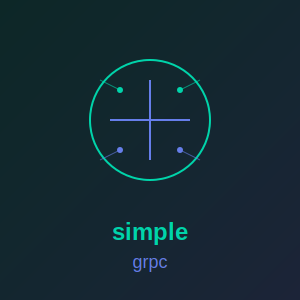

<p align="center">
  
</p>

# simple_grpc

**[Documentation](https://simple-eiffel.github.io/simple_grpc/)** | **[GitHub](https://github.com/simple-eiffel/simple_grpc)**

[](https://opensource.org/licenses/MIT)
[](https://www.eiffel.org/)
[]()
[]()

gRPC protocol for Eiffel: Protocol Buffers, HTTP/2, streaming RPC, service definitions.

Part of the [Simple Eiffel](https://github.com/simple-eiffel) ecosystem.

## Status

**Beta**

## Overview

simple_grpc provides gRPC protocol support for Eiffel applications including Protocol Buffers wire format encoding/decoding, HTTP/2 frame structures, and gRPC service definitions with all four method types. Built with Design by Contract and SCOOP compatibility.

```eiffel
-- Create a gRPC client call
local
    grpc: SIMPLE_GRPC
    channel: SIMPLE_GRPC_CHANNEL
    request: SIMPLE_PROTOBUF_MESSAGE
do
    create grpc.make
    channel := grpc.new_channel ("localhost", 50051)
    channel.connect

    request := grpc.new_message
    request.set_string (1, "World")

    if attached channel.new_call (service, "SayHello") as call then
        call.set_request (request)
        call.start
    end
end
```

## Features

- **Protocol Buffers** - Wire format encoding/decoding (varint, fixed, length-delimited, ZigZag)
- **HTTP/2 Framing** - DATA, HEADERS, SETTINGS, WINDOW_UPDATE, PING, GOAWAY frames
- **gRPC Protocol** - Service definitions, method types, status codes, metadata
- **Streaming Support** - Unary, server streaming, client streaming, bidirectional

## Installation

1. Set the ecosystem environment variable (one-time setup for all simple_* libraries):
```bash
export SIMPLE_EIFFEL=D:\prod
```

2. Add to ECF:
```xml
<library name="simple_grpc" location="$SIMPLE_EIFFEL/simple_grpc/simple_grpc.ecf"/>
```

## Method Types

```eiffel
-- Unary: single request -> single response
service.add_unary_method ("GetUser", "GetUserRequest", "User")

-- Server streaming: single request -> stream of responses
service.add_server_streaming_method ("ListUsers", "ListUsersRequest", "User")

-- Client streaming: stream of requests -> single response
service.add_client_streaming_method ("RecordData", "DataPoint", "Summary")

-- Bidirectional: stream <-> stream
service.add_bidirectional_method ("Chat", "Message", "Message")
```

## Dependencies

- simple_http - HTTP/2 transport (future)

## License

MIT License
